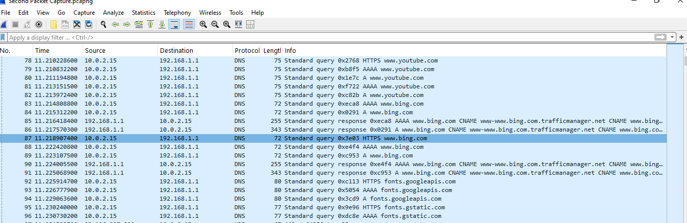
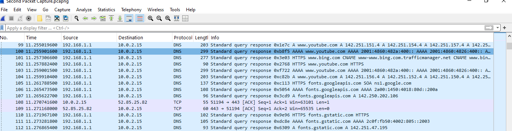
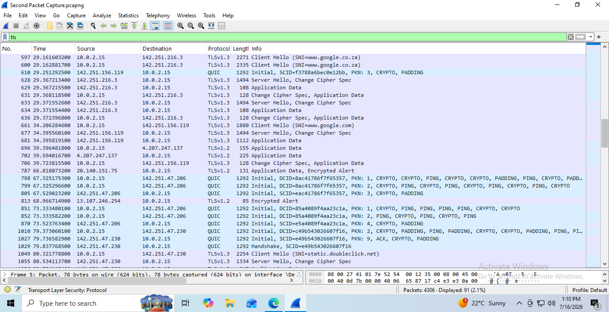
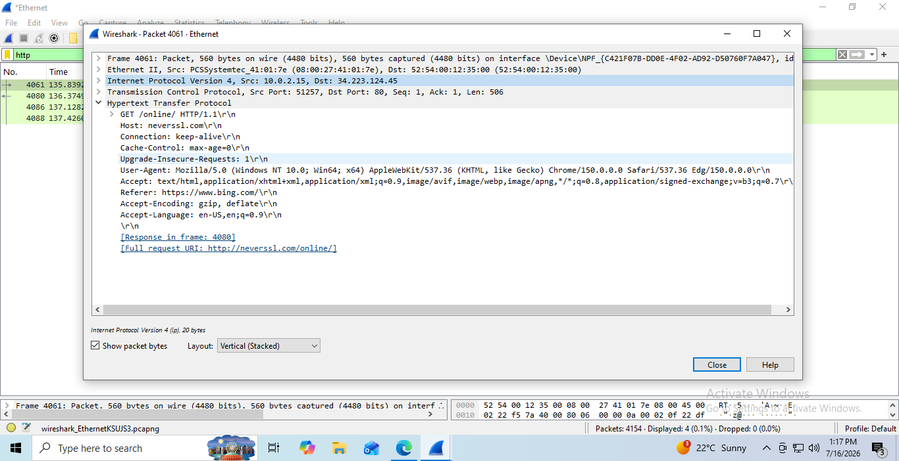
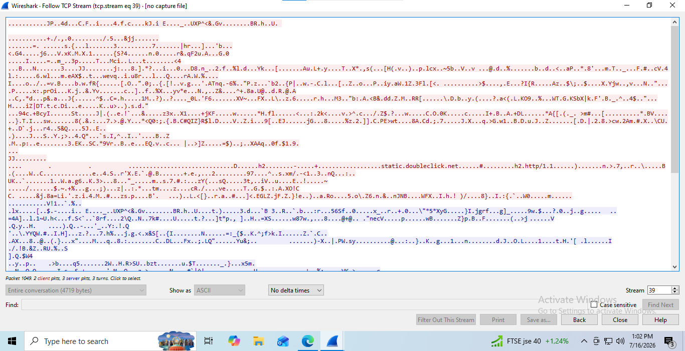
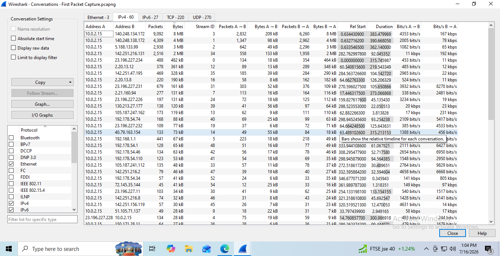
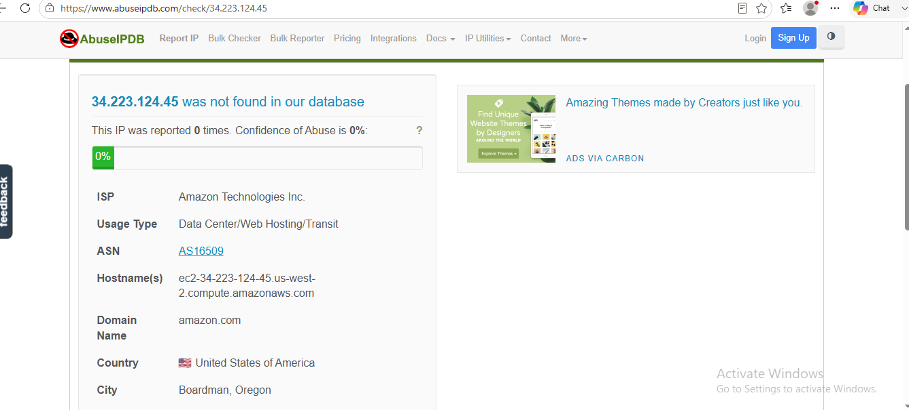

# Network Traffic Analysis with Wireshark

## Project Overview

This project demonstrates practical network traffic analysis using Wireshark in a virtual lab environment. The objective was to capture, inspect, and investigate network traffic while learning how common network protocols work together and how to analyze them from a security analyst's perspective.

Rather than simply identifying packets, this project focuses on reconstructing events, investigating network conversations, validating IP ownership, and documenting findings using an evidence-based approach similar to that used by Security Operations Center (SOC) analysts.

---

## Objectives

- Capture live network traffic using Wireshark.
- Analyze DNS requests and responses.
- Understand TCP communication.
- Investigate TLS encrypted traffic.
- Compare HTTP and HTTPS traffic.
- Analyze network conversations.
- Investigate external IP addresses.
- Build an incident timeline.
- Document findings professionally.

## Tools Used

- Wireshark
- Oracle VirtualBox
- Windows 10 Virtual Machine
- Ubuntu Server (Lab Environment)
- IP Intelligence Lookup Services
- NeverSSL

## Skills Demonstrated

- Network Traffic Analysis
- Packet Analysis
- DNS Investigation
- TCP Communication Analysis
- TLS Encryption Analysis
- HTTP Protocol Analysis
- Network Conversation Analysis
- IP Address Investigation
- Incident Investigation
- Evidence-Based Reporting

## Lab Environment

The analysis was performed inside a controlled virtual lab environment using Oracle VirtualBox.

Lab Components:

- Windows 10 Virtual Machine
- Ubuntu Server Virtual Machine
- NAT Networking
- Wireshark Packet Capture
- Web browsing activity (Google, Bing, YouTube)
- HTTP traffic generated using NeverSSL
## Investigation Methodology

The investigation followed a structured methodology similar to that used by Security Operations Center (SOC) analysts.

1. Captured live network traffic using Wireshark.
2. Identified common protocols present in the capture.
3. Examined DNS requests and responses.
4. Investigated TCP and TLS communication.
5. Compared encrypted HTTPS traffic with unencrypted HTTP traffic using NeverSSL.
6. Reviewed network conversations to identify the most active communications.
7. Performed IP address enrichment using public intelligence sources.
8. Validated findings using application-layer evidence such as HTTP headers.
9. Documented conclusions based on observed evidence.
10. 
## Investigation Timeline

### Event 1 – DNS Resolution

The client initiated a DNS query requesting the IP address of a website before any communication could occur.

### Event 2 – DNS Response

The DNS server successfully returned the requested address, allowing the client to identify the destination server.

### Event 3 – Connection Establishment

The client established communication with the destination server using standard web protocols.

### Event 4 – Secure Communication

The client negotiated an encrypted session before exchanging application data, protecting the confidentiality of the communication.

### Event 5 – Resource Request

The client requested web resources from the destination server. HTTP analysis showed legitimate requests consistent with normal browsing and Windows Update activity.

### Event 6 – Investigation Outcome

Initially unfamiliar external IP addresses were investigated through IP intelligence lookups and packet inspection. Application-layer evidence confirmed the observed traffic was legitimate and no malicious activity was identified.

## Key Findings

### DNS Analysis

Successfully captured and analyzed DNS queries and responses for multiple domains including Google, Bing, and YouTube. Observed how domain names are resolved into IP addresses before communication begins.

### TCP and TLS Analysis

Observed the establishment of secure network sessions, including TCP communication and TLS handshakes. Verified that application data was encrypted and could not be read directly without the appropriate encryption keys.

### HTTP Analysis

Captured plaintext HTTP traffic using NeverSSL to compare it with encrypted HTTPS traffic. Identified HTTP request methods, including GET, and examined important HTTP headers such as Host and User-Agent.

### Network Conversation Analysis

Used Wireshark's Conversations feature to identify the most active communications and determine which systems transferred the greatest amount of network traffic.

### IP Intelligence Investigation

Performed IP address enrichment using public intelligence sources. Investigated unfamiliar IP addresses by examining ownership, hosting providers, and application-layer evidence before determining whether the communication was legitimate.

### Investigation Outcome

A potentially suspicious external IP address was investigated in detail. Packet analysis revealed that the communication was associated with legitimate Microsoft Windows Update activity. No evidence of malicious behavior was identified during the investigation.

## Lessons Learned

This project reinforced several important cybersecurity concepts:

- DNS queries identify where a service is located before communication begins.
- TCP provides reliable communication between systems.
- TLS encrypts network traffic, protecting sensitive information from being read in transit.
- HTTP headers can reveal valuable investigative information even when the content itself is encrypted.
- IP addresses should never be judged solely by their geographic location or hosting provider.
- Effective investigations require collecting evidence from multiple sources before reaching a conclusion.
- Security analysts should focus on understanding the sequence of events rather than analyzing individual packets in isolation.  

## Packet Captures

The original packet capture files used during this investigation are available below.

- [Packet Capture 1](Captures/packet-capture-1.pcapng)
- [Packet Capture 2](Captures/packet-capture-2.pcapng)
- [Packet Capture 3](Captures/packet-capture-3.pcapng)

## Screenshots

### DNS Query

### DNS Response

### TLS Handshake

### HTTP GET Request

### TCP Stream

### Network Conversations

### IP Investigation

## Future Improvements

Future work for this project includes:

- Investigating malicious packet captures
- Performing malware traffic analysis
- Creating detection rules based on captured traffic
- Automating packet analysis with Zeek
- Expanding the investigation to include IPv6 traffic

## Author

**Siphamandla Macamo**

CompTIA Security+ Certified

Aspiring SOC Analyst

GitHub Portfolio Project
